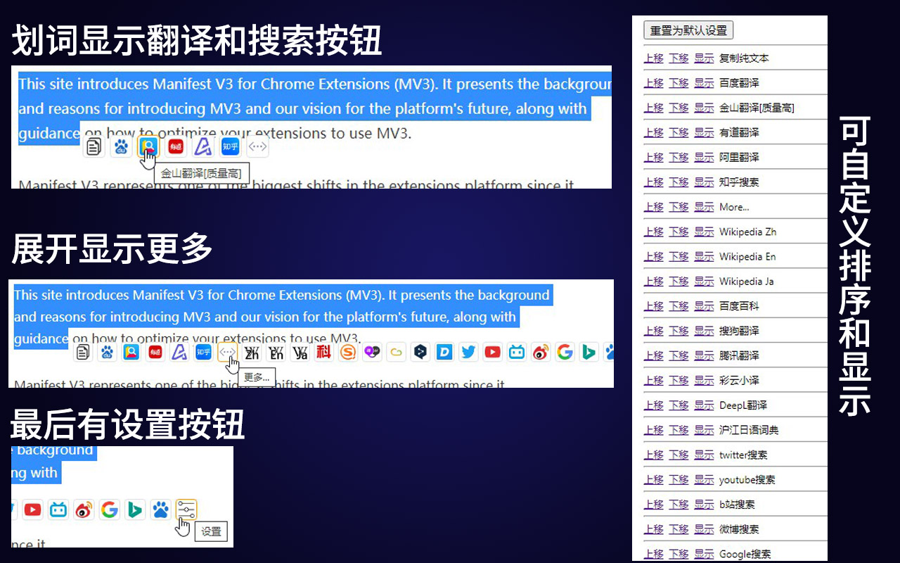

# 版本
0.0.4

# AI-Translate-and-Search
划词AI翻译+搜索：
* **AI翻译按质量和热度综合排序。调用：** 金山翻译，有道翻译，阿里翻译，百度翻译，搜狗翻译，腾讯翻译，彩云小译，DeepL，沪江日语词典等。
* **搜索包含：** 知乎，b站，微博，百科, wiki，youtube，twitter等。
* **设置：** 展开后，点击最后的设置按钮可以调整 排序 和 是否显示。

# 预览图
  

# 安装
Chrome商店：   
[https://chrome.google.com/webstore/detail/ai%E7%BF%BB%E8%AF%91%E5%92%8C%E6%90%9C%E7%B4%A2/hgccnmjdlfakepijceijgkbicglomcoa](https://chrome.google.com/webstore/detail/ai%E7%BF%BB%E8%AF%91%E5%92%8C%E6%90%9C%E7%B4%A2/hgccnmjdlfakepijceijgkbicglomcoa)  

微软商店：  
[https://microsoftedge.microsoft.com/addons/detail/ai%E7%BF%BB%E8%AF%91%E5%92%8C%E6%90%9C%E7%B4%A2/pjabfcclidincekoodjmojglmmjkkdhl](https://microsoftedge.microsoft.com/addons/detail/ai%E7%BF%BB%E8%AF%91%E5%92%8C%E6%90%9C%E7%B4%A2/pjabfcclidincekoodjmojglmmjkkdhl)  

# 创作说明
根据barrer发布的用户脚本改编。  
https://github.com/barrer/tampermonkey-script  

**修改说明：**  
* 添加阿里翻译，腾讯翻译，彩云小译等
* 重新排序，翻译按照质量和热度综合排序
* 修改百度翻译为自动识别语言
* 修改沪江英语词典为沪江日语词典
* 增加搜索：知乎，b站，微博，百科，中日英3语wiki，youtube，twitter等
* 去掉大量不常用词典

# AI翻译服务质量
AI翻译服务，质量差异主要体现在：词汇量 和 语言通畅程度 两个方面。尤其是非英语翻译，比如日语翻译。  

综合来看，质量比较好的，是 金山翻译。然而，通过脚本调用翻译页面时，则有些不便。各翻译服务问题列举如下： 
* **金山翻译：** 翻译质量高，且 单词 翻译提供详细字典。但长文翻译时，通过脚本调用无法分段落。  
* **阿里翻译：** 曾经质量很高，之后似乎更换引擎重新学习，如今质量一落千丈。默认是把内容翻译成英文，需要手动选一下中文。  
* **有道翻译：** 翻译质量比金山差，和百度各有千秋，但排版更好，脚本调用便利  
* **腾讯翻译：** 词汇量较高，但语言组织不如金山顺畅。  
* **搜狗翻译：** 语言通畅程度好，但词汇量略少。  
* **百度翻译：** 做得久，名气大，质量中规中矩。  
* **DeepL：** 语言流畅程度好，但日语等语种的词汇量小。而且它是把所有语言先翻译成德语，再把生成的德语翻译成目标语言，因此出错率更高，甚至出现无法翻译的情况。  
* **彩云小译：**  日语词汇量较大，能准确翻译 烧卖、美人鱼等其他翻译服务经常翻译错误的娱乐领域词汇。详情参见：
[彩云小译的日文词汇量优势](https://github.com/lmk123/crx-selection-translate/issues/466#issuecomment-743978724)  
* **Google翻译：** 质量稀烂。Google也是AI翻译，但是，他是把所有语言，先翻译成英语，再把机器翻译的英语，翻译成目标语言。英语是个非常不严谨的语言，于是大量的同义词和歧义语境，在二次转换后，全部翻译错误。质量烂到难以忍受。给google翻译提交建议的时候，被官方社区的管理人员踢皮球。可见这个翻译产品，今后也是不可能做好的。因此，这里不予添加。  

# 更新说明
### 0.0.4
* 更新到manifest v3。老旧版本的套壳浏览器不再能够使用本扩展。

### 0.0.3
* option页面添加utf-8编码的明确指示。不然原生Chrome浏览器选项页面会变成乱码。套壳浏览器没有此类问题。

### 0.0.2  
* 把content script和option script公用的代码提出来，放到share.js中。
* 默认设置中，用腾讯翻译代替阿里翻译。阿里翻译问题参见上面的说明。
